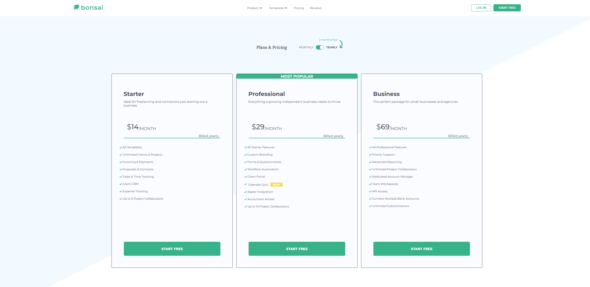

🌱 Pricing Page – Navigation, Plan Switcher & FAQ (Vanilla JS + SCSS)

An interactive pricing page with dropdown navigation, a Monthly/Yearly plan switcher, and a FAQ accordion.
Built with Vanilla JavaScript (ES6) and SCSS using the BEM methodology, fully responsive across devices.

🌍 Live Demo

🔗 https://bonsai-pricing-website.netlify.app/

📸 Preview

📌 Features

Dropdown Navigation – Hovering over "Product" reveals multi-level nested menus.

Pricing Toggle – Switch between Monthly and Yearly plans:

dynamically updates prices,

highlights the active option,

adjusts spacing/padding in pricing cards.

FAQ Accordion – Expand/collapse questions one at a time, with rotating arrow icons.

Responsive Layout – Optimized for desktop, tablet, and mobile.

SCSS with BEM – Clean and maintainable styling structure.

🛠️ Tech Stack

HTML5 – Semantic structure

SCSS (BEM) – Modular, scalable styling

Vanilla JavaScript (ES6) – DOM manipulation and interactivity

🚀 Installation & Setup

Quick view (static project):

Clone the repository and navigate to the project folder:

git clone <repo-url>
cd <project-folder>

Open the project in your browser:

double-click index.html, or

drag index.html into a browser window.

Optional – local server (recommended for development):

# one of the following:
npx serve .
# or use Live Server extension in VS Code

If editing .scss files, remember to compile them into .css
(e.g. sass src/scss:dist/css --watch or your preferred watcher).

🔍 How It Works (Logic Overview)

Navigation: mouseenter/mouseleave events on .navigation__dropdown-items--arrow toggle the side dropdown panel (.navigation__dropdown-content-aside).

Pricing Switcher: change event on .pricing__switch:

toggles bold state of the active option,

shows/hides yearly pricing elements,

updates .offer__price dynamically.

FAQ: Clicking .question__item-icon expands the corresponding description and collapses all others, while rotating the clicked icon.

📚 What I Learned

Working with the DOM API and events (mouseenter, mouseleave, click, change).

Dynamic content updates – toggling classes, updating text, showing/hiding elements.

Accordion logic – ensuring only one section stays open at a time.

Writing structured SCSS with BEM and responsive media queries.

UX details – active state styling, consistent padding, and user-friendly dropdowns.

📬 Contact

🔗 GitHub: Konrad2502

✉️ Email: konrad.litak@gmail.com